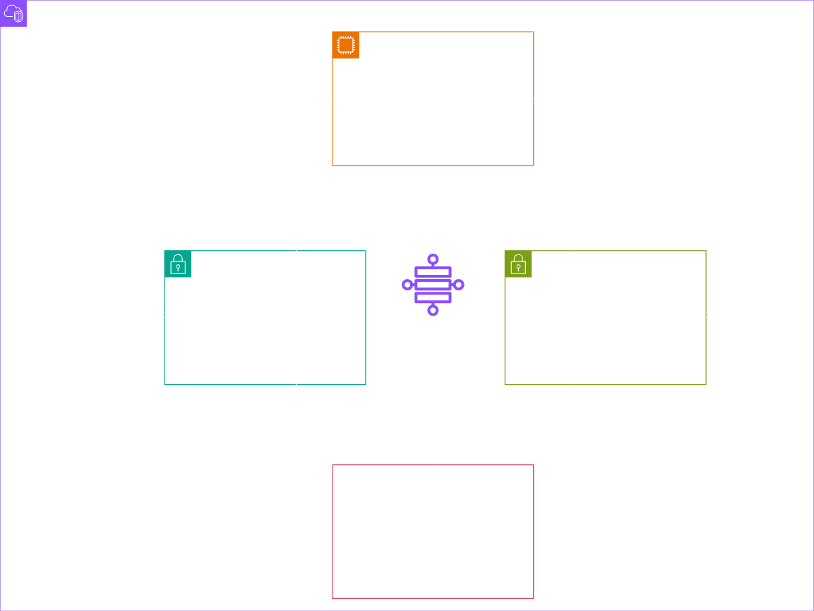

# Desenho base da ideia desse projeto Terraform




# Terraform EKS Cluster Setup

Este projeto contém um conjunto de arquivos Terraform que automatizam a criação de um cluster Amazon EKS (Elastic Kubernetes Service) com subnets, VPC, grupos de nós e configurações básicas de provedor.

## Estrutura dos arquivos

- **`providers.tf`**: Define o provedor AWS e configurações globais.
- **`variables.tf`**: Contém as variáveis utilizadas nos módulos Terraform.
- **`vpc.tf`**: Cria uma VPC e sub-redes públicas para o cluster EKS.
- **`cluster.tf`**: Define o recurso principal do cluster EKS.
- **`nodes.tf`**: Cria o Node Group (grupo de nós) para o cluster EKS.

## Pré-requisitos

- [Terraform >= 1.5.7](https://www.terraform.io/downloads)
- AWS CLI configurado com permissões para criar recursos EKS
- Credenciais válidas da AWS configuradas via `aws configure` ou variáveis de ambiente

## Como usar

1. Clone o repositório:
```bash
git clone https://github.com/seu-usuario/seu-repo.git
cd seu-repo
```

2. Inicialize o Terraform:
```bash
terraform init
```

3. Visualize o plano de execução:
```bash
terraform plan
```

4. Aplique a infraestrutura:
```bash
terraform apply
```

5. Para destruir os recursos:
```bash
terraform destroy
```

## Variáveis principais

Veja o arquivo `variables.tf` para uma lista completa. Algumas importantes incluem:

- `region`: Região da AWS onde o cluster será criado. (us-east-1)
- `prefix`: Prefixo usado para nomear recursos. (projeto-k8s-teste-aws)
- `instance_types`: Tipos de instância EC2 para os nós. (t2-micro para garantir o free tier)
- `desired_size` = 2
- `max_size` = 2
- `min_size` = 1

## Observações

- As subnets devem estar com IP público habilitado se os nós precisarem de acesso à internet.
- Certifique-se de que os limites de serviço da AWS para EKS e EC2 estejam dentro dos valores permitidos.
